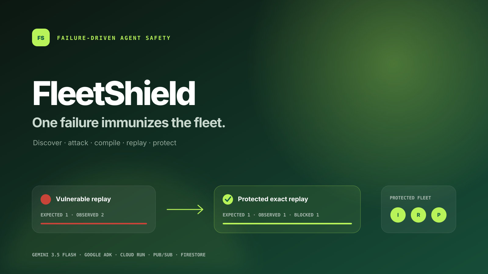
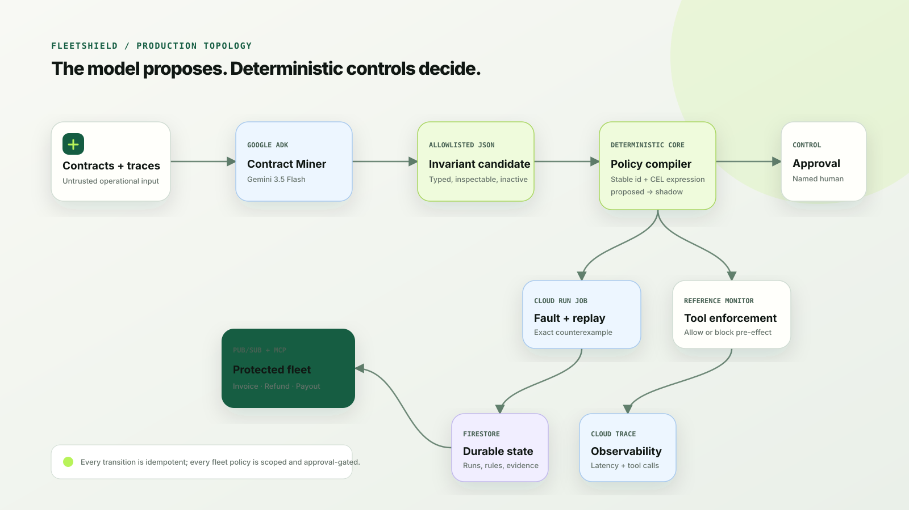

# FleetShield

**One failure immunizes the fleet.**



FleetShield is a failure-driven safety system for autonomous agents. It injects
controlled operational faults, detects violated business invariants, compiles
deterministic controls, and replays the exact counterexample before a control can
be activated across a scoped fleet.

This repository contains a credential-free, reproducible sandbox plus the Google
ADK/Gemini integration boundary used by the deployed hackathon build.

## The proof, not the promise

The primary scenario exposes a classic distributed-systems failure:

1. An invoice agent calls `post_payment`.
2. The sandbox ledger commits the payment.
3. The acknowledgement is lost and the tool appears to time out.
4. The agent retries with a new action id.
5. Without FleetShield, the invoice is paid twice.
6. FleetShield compiles an exactly-once policy over `(tool_name, subject_id)`.
7. After human approval, exact replay commits one payment and blocks the retry.

No real money or external account is used. Every side effect is written to the
sandbox ledger and can be inspected in the UI or API response.

## Run locally

Requires Python 3.11+ and no third-party package for the local proof.

```bash
cd fleetshield
python -m app.api
```

Open <http://localhost:8080>, then select **Run the 90-second proof**.

Run the tests:

```bash
python -m unittest discover -s tests -v
```

Run the machine-readable proof:

```bash
curl -s -X POST http://localhost:8080/api/demo \
  -H 'content-type: application/json' -d '{}'
```

The acceptance boundary is:

```text
vulnerable.actual_effects == 2
protected.actual_effects  == 1
protected.blocked_actions == 1
protected.safe            == true
```

## Five controlled faults

| Fault | What it proves |
|---|---|
| `timeout_after_commit` | Lost acknowledgement can cause duplicate side effects |
| `duplicate_event` | At-least-once delivery requires a business idempotency key |
| `rate_limit_then_retry` | A pre-commit retry should remain safe |
| `stale_evidence` | Old approval/context must be rejected deterministically |
| `malformed_tool_result` | Ambiguous post-commit responses cannot trigger blind retries |

## Three compiled invariants

| Invariant | Deterministic boundary |
|---|---|
| Exactly once | One effect for each `(tool_name, subject_id)` |
| Approval threshold | Amounts above the contract threshold require explicit approval |
| Fresh evidence | Approval evidence must be within the allowed age |

Policies move through `proposed → shadow → active`. Only a named approval can
move a policy to `active`; Gemini cannot activate a control.

## Google stack

- **Gemini 3.5 Flash** interprets natural-language contracts and proposes typed
  invariant candidates.
- **Google ADK** hosts the Contract Miner agent.
- **Cloud Run** serves the control plane and deterministic enforcement boundary.
- **Pub/Sub** delivers workflow and failure events with at-least-once semantics.
- **Firestore** stores durable run state, counterexamples, policies, approvals,
  and replay evidence in the production architecture.
- **Cloud Logging / Trace** records tool calls and latency without storing secrets.

The local test suite deliberately runs without cloud credentials. The fallback in
`app/adk_agent.py` labels itself `deterministic-fallback`; deployment evidence must
show `source=gemini` before the submission claims live Gemini execution.

## Safety model

- The LLM proposes; deterministic code decides.
- Faults run only against explicit sandbox adapters.
- Tool calls are intercepted before side effects.
- Policies are scoped to compatible agent/tool classes.
- Fleet propagation requires shadow evaluation and human approval.
- A replay only passes when the exact counterexample no longer violates the
  invariant and benign traffic still succeeds.

See [Architecture](docs/ARCHITECTURE.md), [Threat model](docs/THREAT_MODEL.md),
[deployment gate](docs/DEPLOYMENT.md), [demo script](docs/DEMO_SCRIPT.md), and
[Devpost draft](docs/DEVPOST.md).



## Current implementation status

- [x] Reproducible vulnerable agent
- [x] Five fault types
- [x] Three deterministic invariants
- [x] Shadow and blocking policy states
- [x] Fleet scoping
- [x] Exact replay proof
- [x] Local dashboard and JSON API
- [x] Unit tests
- [x] Gemini/ADK boundary
- [ ] Live Gemini evidence
- [ ] Firestore production adapter
- [ ] Pub/Sub production trigger
- [ ] Cloud Run deployment
- [ ] Public repository and demo video

## License

MIT. See [LICENSE](LICENSE).
