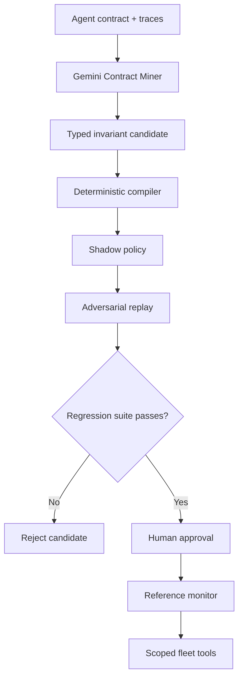
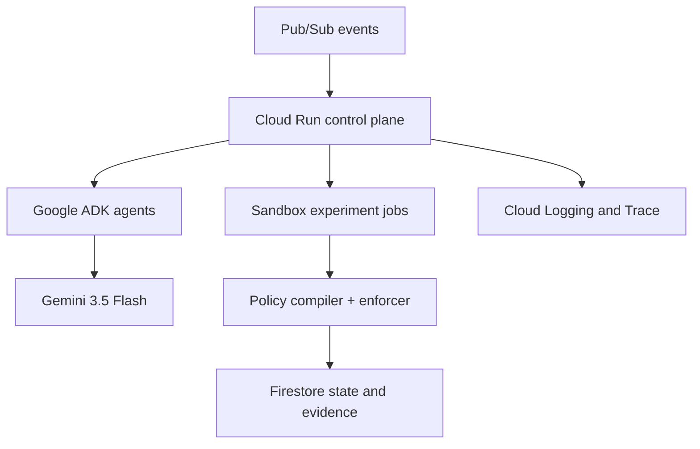

# FleetShield architecture

## Design principle

FleetShield separates probabilistic interpretation from deterministic authority.
Gemini may infer a candidate invariant from a contract and a counterexample, but
only the policy compiler and reference monitor decide whether a tool call proceeds.

## Production topology

## Components

### Contract Miner

Reads a natural-language agent contract and a failing trace. It may propose only
an allowlisted invariant schema. Its output is untrusted structured input.

### Fault Director

Creates controlled counterexamples: duplicated delivery, lost acknowledgement,
429 before commit, stale evidence, or malformed post-commit output. Production
adapters must explicitly declare themselves safe for destructive tests.

### Policy Compiler

Converts a typed invariant into a stable policy id, an inspectable CEL-style
expression, and a deterministic evaluator. The model does not execute the policy.

### Reference Monitor

Intercepts every relevant tool call before the side effect. It reads current
ledger state and active policies, then returns allow or block plus evidence.

### Replay Verifier

Runs the original counterexample and a benign control case. A candidate cannot
advance when it only suppresses the entire workflow or introduces false positives.

### Fleet Immunizer

Finds agents with the same declared side-effect class, runs the policy in shadow
mode, and requests approval. It never propagates solely on semantic similarity.

## Durable state model

Firestore collections in the deployed version:

- `agent_contracts/{agent_id}`
- `experiments/{run_id}`
- `experiments/{run_id}/events/{sequence}`
- `counterexamples/{counterexample_id}`
- `policies/{policy_id}`
- `approvals/{approval_id}`
- `ledger/{entry_id}`

Every state transition uses an idempotency key. Pub/Sub redelivery is expected,
not treated as an exception.

## Trust boundaries

1. External contracts and traces are untrusted.
2. Gemini output is untrusted.
3. Compiled policies are inactive until deterministic validation passes.
4. Experiment tools cannot access production credentials.
5. Fleet propagation requires a human approval record.
6. The reference monitor, not the agent, owns the final tool authorization.

